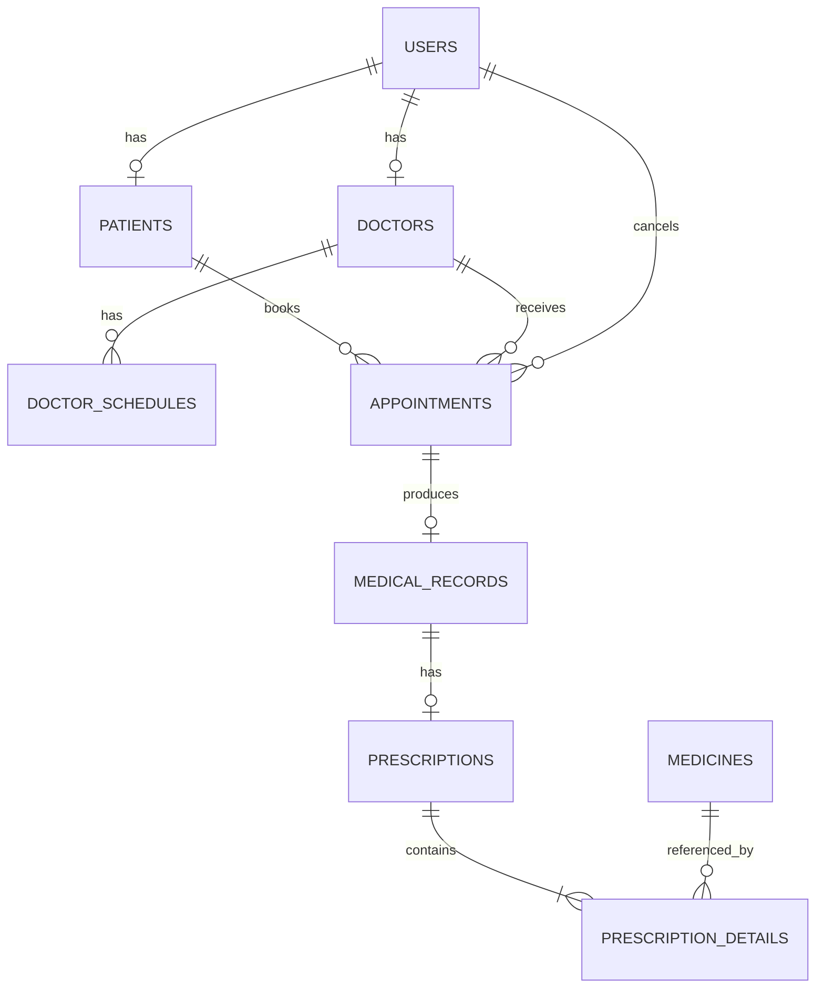

# 06 - Physical Database Schema & ERD

## 1. Mục tiêu

Tài liệu này chuyển Domain Model ở bước 05 thành schema database vật lý cho MySQL.

Mục tiêu:
- Chốt table và column.
- Chốt kiểu dữ liệu.
- Chốt PK / FK.
- Chốt NOT NULL / UNIQUE.
- Chốt index theo use case.
- Chốt cách chống double booking.
- Cho phép rebook slot đã CANCELLED.
- Tạo ERD bản đầu.
- Chuẩn bị cho JPA Entity và migration.

---

## 2. Database lựa chọn

MVP sử dụng:

```text
MySQL 8.x
```

Charset đề xuất:

```text
utf8mb4
```

Primary key cho các table business chính:

```text
BIGINT AUTO_INCREMENT
```

Audit fields:

```text
created_at DATETIME NOT NULL
updated_at DATETIME NOT NULL
```

---

## 3. users

```sql
CREATE TABLE users (
    id BIGINT PRIMARY KEY AUTO_INCREMENT,
    email VARCHAR(255) NOT NULL,
    password_hash VARCHAR(255) NOT NULL,
    role VARCHAR(30) NOT NULL,
    status VARCHAR(20) NOT NULL,
    created_at DATETIME NOT NULL,
    updated_at DATETIME NOT NULL,
    CONSTRAINT uk_users_email UNIQUE (email)
);
```

Role:

```text
ADMIN
DOCTOR
RECEPTIONIST
PATIENT
```

Status:

```text
ACTIVE
INACTIVE
```

Không dùng MySQL ENUM; dùng VARCHAR + Java enum.

---

## 4. patients

```sql
CREATE TABLE patients (
    id BIGINT PRIMARY KEY AUTO_INCREMENT,
    user_id BIGINT NOT NULL,
    full_name VARCHAR(150) NOT NULL,
    phone VARCHAR(30),
    date_of_birth DATE,
    gender VARCHAR(20),
    address VARCHAR(500),
    created_at DATETIME NOT NULL,
    updated_at DATETIME NOT NULL,

    CONSTRAINT uk_patients_user_id UNIQUE (user_id),
    CONSTRAINT fk_patients_user
        FOREIGN KEY (user_id) REFERENCES users(id)
);
```

Quan hệ:

```text
User 1 ---- 0..1 Patient
```

---

## 5. doctors

```sql
CREATE TABLE doctors (
    id BIGINT PRIMARY KEY AUTO_INCREMENT,
    user_id BIGINT NOT NULL,
    full_name VARCHAR(150) NOT NULL,
    phone VARCHAR(30),
    specialty VARCHAR(120) NOT NULL,
    license_number VARCHAR(100) NOT NULL,
    bio TEXT,
    created_at DATETIME NOT NULL,
    updated_at DATETIME NOT NULL,

    CONSTRAINT uk_doctors_user_id UNIQUE (user_id),
    CONSTRAINT uk_doctors_license_number UNIQUE (license_number),
    CONSTRAINT fk_doctors_user
        FOREIGN KEY (user_id) REFERENCES users(id)
);
```

---

## 6. doctor_schedules

MVP dùng weekly recurring schedule.

```sql
CREATE TABLE doctor_schedules (
    id BIGINT PRIMARY KEY AUTO_INCREMENT,
    doctor_id BIGINT NOT NULL,
    day_of_week VARCHAR(20) NOT NULL,
    start_time TIME NOT NULL,
    end_time TIME NOT NULL,
    created_at DATETIME NOT NULL,
    updated_at DATETIME NOT NULL,

    CONSTRAINT fk_doctor_schedules_doctor
        FOREIGN KEY (doctor_id) REFERENCES doctors(id),

    CONSTRAINT chk_doctor_schedule_time
        CHECK (start_time < end_time)
);
```

Index:

```sql
CREATE INDEX idx_doctor_schedules_doctor_day
ON doctor_schedules (doctor_id, day_of_week);
```

Schedule overlap vẫn validate ở service layer.

---

## 7. Appointment date/time strategy

MVP dùng:

```text
appointment_date DATE
start_time TIME
end_time TIME
```

Lý do:
- query thường theo doctor + date;
- khớp tốt với weekly schedule;
- mapping tự nhiên sang LocalDate + LocalTime.

---

## 8. appointments

```sql
CREATE TABLE appointments (
    id BIGINT PRIMARY KEY AUTO_INCREMENT,

    patient_id BIGINT NOT NULL,
    doctor_id BIGINT NOT NULL,

    appointment_date DATE NOT NULL,
    start_time TIME NOT NULL,
    end_time TIME NOT NULL,

    status VARCHAR(20) NOT NULL,
    reason VARCHAR(500) NOT NULL,

    confirmed_at DATETIME NULL,
    cancelled_at DATETIME NULL,
    cancelled_by_user_id BIGINT NULL,
    cancel_reason VARCHAR(500) NULL,
    completed_at DATETIME NULL,

    active_doctor_slot VARCHAR(255)
        GENERATED ALWAYS AS (
            CASE
                WHEN status IN ('PENDING', 'CONFIRMED')
                THEN CONCAT(
                    doctor_id, '#',
                    DATE_FORMAT(appointment_date, '%Y-%m-%d'), '#',
                    TIME_FORMAT(start_time, '%H:%i:%s')
                )
                ELSE NULL
            END
        ) STORED,

    created_at DATETIME NOT NULL,
    updated_at DATETIME NOT NULL,

    CONSTRAINT fk_appointments_patient
        FOREIGN KEY (patient_id) REFERENCES patients(id),

    CONSTRAINT fk_appointments_doctor
        FOREIGN KEY (doctor_id) REFERENCES doctors(id),

    CONSTRAINT fk_appointments_cancelled_by
        FOREIGN KEY (cancelled_by_user_id) REFERENCES users(id),

    CONSTRAINT chk_appointments_time
        CHECK (start_time < end_time),

    CONSTRAINT uk_appointments_active_doctor_slot
        UNIQUE (active_doctor_slot)
);
```

---

## 9. Vì sao generated column giải quyết rebooking?

Appointment active:

```text
doctor_id = 5
date = 2026-09-10
start_time = 10:00
status = PENDING
```

Generated key:

```text
5#2026-09-10#10:00:00
```

Unique constraint chặn Appointment active thứ hai cùng slot.

Khi status thành:

```text
CANCELLED
```

generated column thành:

```text
NULL
```

MySQL cho phép nhiều NULL trong unique index, vì vậy slot được đặt lại nhưng Appointment cũ vẫn giữ lịch sử.

Generated key chỉ áp dụng với:

```text
PENDING
CONFIRMED
```

---

## 10. Double booking protection

Application vẫn check trước để fail fast.

Database unique constraint là lớp bảo vệ cuối cho race condition.

```text
Request A -> check empty
Request B -> check empty

Request A -> INSERT SUCCESS
Request B -> UNIQUE VIOLATION
```

Backend map thành:

```text
409 CONFLICT
APPOINTMENT_SLOT_ALREADY_BOOKED
```

---

## 11. Patient time conflict

MVP kiểm tra ở application layer:

```text
patient_id
appointment_date
start_time
status IN (PENDING, CONFIRMED)
```

Chưa thêm generated unique constraint thứ hai để tránh làm schema quá phức tạp.

---

## 12. Appointment indexes

```sql
CREATE INDEX idx_appointments_doctor_date
ON appointments (doctor_id, appointment_date);

CREATE INDEX idx_appointments_patient_date
ON appointments (patient_id, appointment_date);

CREATE INDEX idx_appointments_date_status
ON appointments (appointment_date, status);
```

---

## 13. medical_records

```sql
CREATE TABLE medical_records (
    id BIGINT PRIMARY KEY AUTO_INCREMENT,
    appointment_id BIGINT NOT NULL,
    symptoms TEXT,
    diagnosis TEXT NOT NULL,
    treatment TEXT,
    notes TEXT,
    created_at DATETIME NOT NULL,
    updated_at DATETIME NOT NULL,

    CONSTRAINT uk_medical_records_appointment
        UNIQUE (appointment_id),

    CONSTRAINT fk_medical_records_appointment
        FOREIGN KEY (appointment_id) REFERENCES appointments(id)
);
```

Quan hệ:

```text
Appointment 1 ---- 0..1 MedicalRecord
```

Không duplicate patient_id / doctor_id vì truy được qua Appointment.

---

## 14. medicines

```sql
CREATE TABLE medicines (
    id BIGINT PRIMARY KEY AUTO_INCREMENT,
    name VARCHAR(200) NOT NULL,
    unit VARCHAR(50),
    description VARCHAR(500),
    active BOOLEAN NOT NULL DEFAULT TRUE,
    created_at DATETIME NOT NULL,
    updated_at DATETIME NOT NULL
);
```

MVP không làm inventory, batch, expiry hay supplier.

---

## 15. prescriptions

```sql
CREATE TABLE prescriptions (
    id BIGINT PRIMARY KEY AUTO_INCREMENT,
    medical_record_id BIGINT NOT NULL,
    notes VARCHAR(1000),
    created_at DATETIME NOT NULL,
    updated_at DATETIME NOT NULL,

    CONSTRAINT uk_prescriptions_medical_record
        UNIQUE (medical_record_id),

    CONSTRAINT fk_prescriptions_medical_record
        FOREIGN KEY (medical_record_id) REFERENCES medical_records(id)
);
```

Quan hệ:

```text
MedicalRecord 1 ---- 0..1 Prescription
```

---

## 16. prescription_details

```sql
CREATE TABLE prescription_details (
    id BIGINT PRIMARY KEY AUTO_INCREMENT,
    prescription_id BIGINT NOT NULL,
    medicine_id BIGINT NOT NULL,

    dosage VARCHAR(100) NOT NULL,
    frequency VARCHAR(100) NOT NULL,
    duration VARCHAR(100) NOT NULL,
    quantity INT,
    instruction VARCHAR(500),

    CONSTRAINT fk_prescription_details_prescription
        FOREIGN KEY (prescription_id) REFERENCES prescriptions(id),

    CONSTRAINT fk_prescription_details_medicine
        FOREIGN KEY (medicine_id) REFERENCES medicines(id),

    CONSTRAINT chk_prescription_details_quantity
        CHECK (quantity IS NULL OR quantity > 0)
);
```

Index:

```sql
CREATE INDEX idx_prescription_details_prescription
ON prescription_details (prescription_id);
```

---

## 17. Delete policy

Không hard delete trong business flow với:

```text
User
Patient
Doctor
Appointment
MedicalRecord
Prescription
PrescriptionDetail
```

User / Doctor / Patient dùng trạng thái INACTIVE.

Medicine dùng:

```text
active = false
```

Appointment dùng:

```text
CANCELLED
```

Không dùng `ON DELETE CASCADE` cho medical history.

---

## 18. Full table list

MVP gồm 9 table:

```text
users
patients
doctors
doctor_schedules
appointments
medical_records
medicines
prescriptions
prescription_details
```

Không có trong MVP:

```text
roles
receptionists
appointment_slots
appointment_status_history
invoices
payments
```

---

## 19. ERD - Mermaid



---

## 20. ERD - Text View

```text
USERS
  |
  +---- 0..1 PATIENTS
  |
  +---- 0..1 DOCTORS
             |
             +---- N DOCTOR_SCHEDULES

PATIENTS 1 ---- N APPOINTMENTS N ---- 1 DOCTORS
                        |
                        | cancelled_by
                        v
                      USERS
                        |
                        | 0..1
                        v
                 MEDICAL_RECORDS
                        |
                        | 0..1
                        v
                  PRESCRIPTIONS
                        |
                        | 1..N
                        v
              PRESCRIPTION_DETAILS
                        |
                        | N..1
                        v
                    MEDICINES
```

---

## 21. Constraint summary

```text
users.email                              UNIQUE
patients.user_id                         UNIQUE
doctors.user_id                          UNIQUE
doctors.license_number                   UNIQUE
appointments.active_doctor_slot          UNIQUE
medical_records.appointment_id           UNIQUE
prescriptions.medical_record_id          UNIQUE
```

---

## 22. Index summary

```text
doctor_schedules(doctor_id, day_of_week)

appointments(doctor_id, appointment_date)

appointments(patient_id, appointment_date)

appointments(appointment_date, status)

prescription_details(prescription_id)
```

Không index mọi column; index theo query thật.

---

## 23. Những business rules DB không xử lý hết

Service layer vẫn kiểm tra:

```text
Doctor ACTIVE
Patient ACTIVE
Appointment không ở quá khứ
Slot thuộc DoctorSchedule
Schedule không overlap
Patient ownership
Doctor ownership
Cancellation deadline
Status transition
Patient time conflict
MedicalRecord chỉ do đúng Doctor tạo
```

Database tập trung vào:

```text
referential integrity
uniqueness
basic structural constraints
concurrency-critical doctor slot
```

---

## 24. Interview points

### Vì sao không chỉ SELECT để kiểm tra slot?

Vì race condition.

### Vì sao DB unique constraint quan trọng?

Nó là lớp cuối bảo vệ data integrity khi nhiều request chạy đồng thời.

### Vì sao generated column?

Để:

```text
PENDING/CONFIRMED -> giữ slot
CANCELLED -> giải phóng slot
```

mà vẫn giữ lịch sử Appointment.

### Vì sao không tạo AppointmentSlot table?

MVP chưa cần quản lý slot như resource độc lập.

Available slot có thể tính:

```text
DoctorSchedule - Active Appointments
```

### Vì sao không UUID?

BIGINT đủ đơn giản và phù hợp monolith portfolio project.

### Vì sao không ON DELETE CASCADE?

Không muốn medical history mất theo account.

---

## 25. Lưu ý JPA

Generated column là implementation detail của MySQL.

Trong JPA không cần coi nó là business field.

Application vẫn làm việc với:

```text
doctorId
appointmentDate
startTime
status
```

Migration chịu trách nhiệm tạo generated column và unique constraint.

Không dùng `CascadeType.ALL` theo thói quen.

Đặc biệt không cascade remove:

```text
Doctor -> Appointment
Patient -> Appointment
```

---

## 26. DDL order

```text
1. users
2. patients
3. doctors
4. doctor_schedules
5. appointments
6. medical_records
7. medicines
8. prescriptions
9. prescription_details
```

Thứ tự này theo foreign-key dependency.

---

## 27. Review cuối bước

Schema hiện tại đáp ứng MVP:

- Multi-role account model rõ.
- Patient / Doctor profile tách riêng.
- Schedule đơn giản nhưng đủ dùng.
- Appointment lifecycle rõ.
- DB-level protection chống double booking Doctor.
- CANCELLED giữ lịch sử nhưng rebook được.
- MedicalRecord 0..1 với Appointment.
- Prescription normalized.
- Không cascade delete nguy hiểm.
- Index dựa trên use case.

Chưa cần:

```text
stored procedure
trigger
partitioning
Redis
distributed lock
event sourcing
status history table
```

---

## 28. Bước tiếp theo

# 07 - REST API Design

Thiết kế contract trước khi code:

1. Auth endpoints.
2. Doctor endpoints.
3. Schedule endpoints.
4. Available-slot endpoint.
5. Appointment endpoints.
6. MedicalRecord endpoints.
7. Prescription endpoints.
8. Request / Response DTO.
9. Validation.
10. HTTP status.
11. Error response format.
12. Pagination / filter / sort.

Sau bước 07 mới sang:

```text
08 - Initialize Spring Boot Project
```
